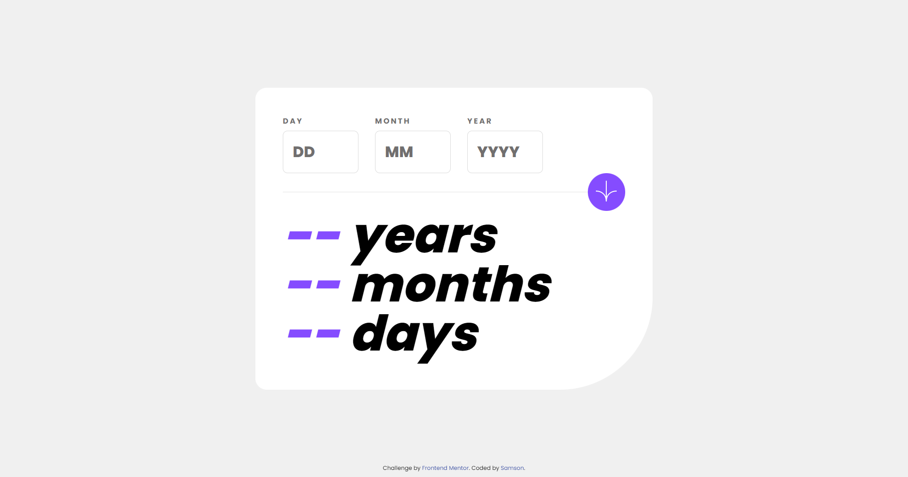
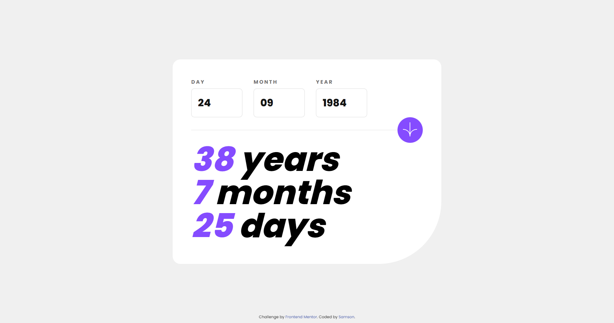

# Frontend Mentor - Age calculator app solution

This is a solution to the [Age calculator app challenge on Frontend Mentor](https://www.frontendmentor.io/challenges/age-calculator-app-dF9DFFpj-Q). Frontend Mentor challenges help you improve your coding skills by building realistic projects.

## Table of contents

-   [Overview](#overview)
    -   [The challenge](#the-challenge)
    -   [Screenshot](#screenshot)
    -   [Links](#links)
-   [My process](#my-process)
    -   [Built with](#built-with)
    -   [What I learned](#what-i-learned)
    -   [Useful resources](#useful-resources)
-   [Author](#author)

## Overview

### The challenge

Users should be able to:

-   View an age in years, months, and days after submitting a valid date through the form
-   Receive validation errors if:
    -   Any field is empty when the form is submitted
    -   The day number is not between 1-31
    -   The month number is not between 1-12
    -   The year is in the future
    -   The date is invalid e.g. 31/04/1991 (there are 30 days in April)
-   View the optimal layout for the interface depending on their device's screen size
-   See hover and focus states for all interactive elements on the page
-   **Bonus**: See the age numbers animate to their final number when the form is submitted

### Screenshot




### Links

-   Solution URL: [Github Link](https://github.com/samzyconcepts/age-calculator-app)
-   Live Site URL: [Live Preview](https://samzyconcepts.github.io/age-calculator-app/)

## My process

### Built with

-   Semantic HTML5 markup
-   CSS custom properties
-   Flexbox
-   Javascript
-   Desktop-first workflow

### What I learned

In the Javascript, I was able to learn how to get the last day of the month

```js
const lastDayOfMonth = new Date(currentYear, currentMonth - 1, 0).getDate()
```

### Useful resources

-   [Javascript Info - Date](https://www.javascript.info/date) - This helped me when checking out the concepts of date and the date methods

```js
const currentDate = new Date(),
	currentYear = currentDate.getFullYear(),
	currentMonth = currentDate.getMonth() + 1,
	currentDay = currentDate.getDate()
```

## Author

-   Frontend Mentor - [@samzyconcepts](https://www.frontendmentor.io/profile/samzyconcepts)
-   Twitter - [@cre8veSam](https://www.twitter.com/cre8veSam) 🚀🚀🚀